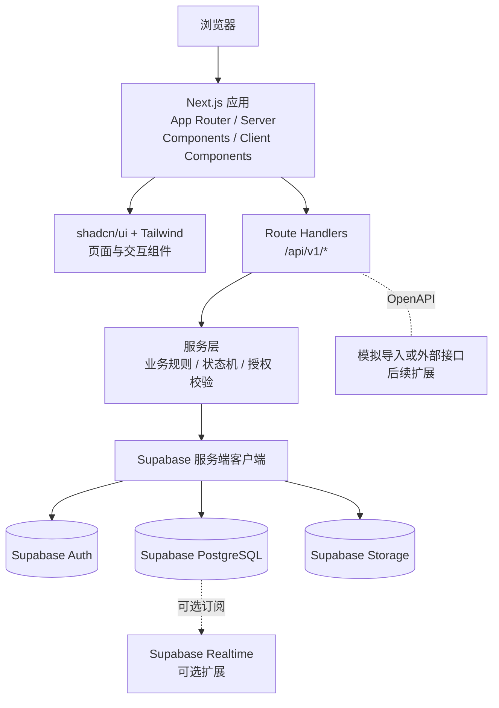

# 核心系统架构与技术决策

| 项目 | 内容 |
| --- | --- |
| 来源 Spec | `specs/001-lims-core/spec.md` |
| 决策编号 | ADR-002 |
| 状态 | Approved（已切换为 Next.js + shadcn/ui + Supabase） |
| 更新时间 | 2026-07-11 |

## 1. 技术栈决策

| 层次 | 选型 | 用途 |
| --- | --- | --- |
| 全栈框架 | Next.js App Router + TypeScript | 页面、服务端组件、Route Handlers 和部署入口 |
| UI | shadcn/ui + Tailwind CSS | 可修改的 UI 源码、布局、表单、表格和反馈组件 |
| 表单与校验 | React Hook Form + Zod | 表单状态、客户端校验和服务端输入校验 |
| 数据服务 | Supabase | BaaS 平台入口 |
| 数据库 | Supabase PostgreSQL | 业务数据、关系、约束和查询 |
| 认证 | Supabase Auth | 登录、会话和身份管理 |
| 文件 | Supabase Storage | 实验附件、报告文件和方法文档 |
| 权限 | PostgreSQL Row Level Security（RLS）+ 服务端授权 | 数据行级访问控制和业务权限校验 |
| API | Next.js Route Handlers + REST/JSON + OpenAPI | 统一前后端接口边界 |
| 类型 | Supabase 生成的 TypeScript 类型 | 数据库和前端类型一致 |
| 测试 | Vitest + Playwright | 单元/组件测试和浏览器验收测试 |
| 部署 | Vercel 或自托管 Next.js；Supabase 托管项目 | 毕业设计演示和后续部署 |

### 1.1 采用该方案的原因

- 当前项目已建立 Next.js 项目骨架、Supabase SSR 客户端分层和数据库迁移目录，可以减少独立后端、认证、文件服务和数据库部署工作。
- Next.js 可以在一个项目中组织页面、服务端逻辑和 API 边界。
- Windows x64 开发环境暂以 `next build --webpack` 作为构建入口；原生 SWC 绑定存在兼容性警告时使用 WASM 回退，避免阻塞本地验证。
- shadcn/ui 提供可直接修改的组件源码，适合建立符合实验室后台场景的界面。
- Supabase 将 PostgreSQL、Auth、Storage 和 RLS 组合在同一平台中，适合本项目的关系数据、用户权限和实验附件。
- 仍然保留 `spec.md`、REST API、OpenAPI、数据库迁移和审计设计，因此不会把系统变成“页面直接读数据库”的无结构应用。

### 1.2 版本策略

- 初始化项目时锁定实际使用的 Node.js、Next.js、React、Supabase CLI 和依赖版本。
- 使用 `package-lock.json` 或 `pnpm-lock.yaml` 固定依赖版本。
- Supabase 数据库变更必须通过版本化 migration 文件提交，禁止只在云端控制台手动修改。
- Next.js 页面、Route Handler、Supabase 服务端客户端和数据库访问必须分层，禁止在页面组件中散落权限和 SQL 逻辑。

## 2. 系统架构



## 3. 代码边界

推荐目录：

```text
src/
├─ app/
│  ├─ (auth)/             # 登录等公开页面
│  ├─ (dashboard)/        # 受保护的后台页面
│  └─ api/v1/             # Route Handlers
├─ components/            # shadcn/ui 和业务组件
├─ lib/
│  ├─ supabase/           # browser/server 客户端
│  ├─ auth/               # 会话和权限辅助函数
│  ├─ validation/         # Zod schema
│  └─ http/               # API 响应和错误处理
├─ modules/
│  ├─ sample/             # 样品业务规则
│  ├─ task/               # 任务状态机
│  ├─ experiment/         # 数据处理和结果
│  ├─ review/             # 审核
│  ├─ report/             # 报告
│  └─ resource/           # 人员、设备、库存、环境
└─ types/                 # 生成类型和共享领域类型
```

## 4. 权限和数据安全

1. Supabase Auth 负责身份认证和会话。
2. 浏览器端只能通过受限的 Supabase 客户端访问公开允许的数据。
3. 每张业务表配置 RLS 策略，避免只依赖前端隐藏按钮。
4. Route Handler 在执行状态变更、审核、发布和附件操作前执行服务端授权。
5. 业务规则放在 `modules/` 服务层，不放在页面组件中。
6. 审计日志使用追加写入策略，关键操作记录操作人、对象、前后状态和时间。
7. Service Role Key 只能出现在服务端环境变量中，不得发送到浏览器。

## 5. 数据和文件策略

- 数据库使用 Supabase PostgreSQL，核心表结构以 migration 文件管理。
- Supabase Auth 用户使用 UUID，业务用户表 `sys_user.id` 直接关联 `auth.users.id`。
- 业务实体可以继续使用 BIGINT 或 UUID，但跨系统暴露的业务编号使用独立的 `VARCHAR` 编号。
- 实验附件和报告文件存入 Supabase Storage，数据库只保存对象路径、类型、大小和关联对象。
- 原始数据和处理数据保留在数据库或受控文件对象中，不能只保留页面显示结果。

## 6. 部署方案

```text
浏览器
  ↓
Next.js 应用（Vercel 或自托管）
  ├─ Server Components / Route Handlers
  └─ Supabase 服务端客户端
       ├─ Supabase Auth
       ├─ PostgreSQL + RLS
       └─ Storage
```

本地开发使用 Supabase CLI 或 Supabase 项目；生产/演示环境使用托管 Supabase 项目。数据库迁移和种子数据必须保存在仓库中。

## 7. 官方参考

- [Next.js 官方文档](https://nextjs.org/docs)
- [shadcn/ui 官方文档](https://ui.shadcn.com/docs)
- [Supabase 官方文档](https://supabase.com/docs)
- [OpenAPI Specification](https://spec.openapis.org/oas/latest.html)
