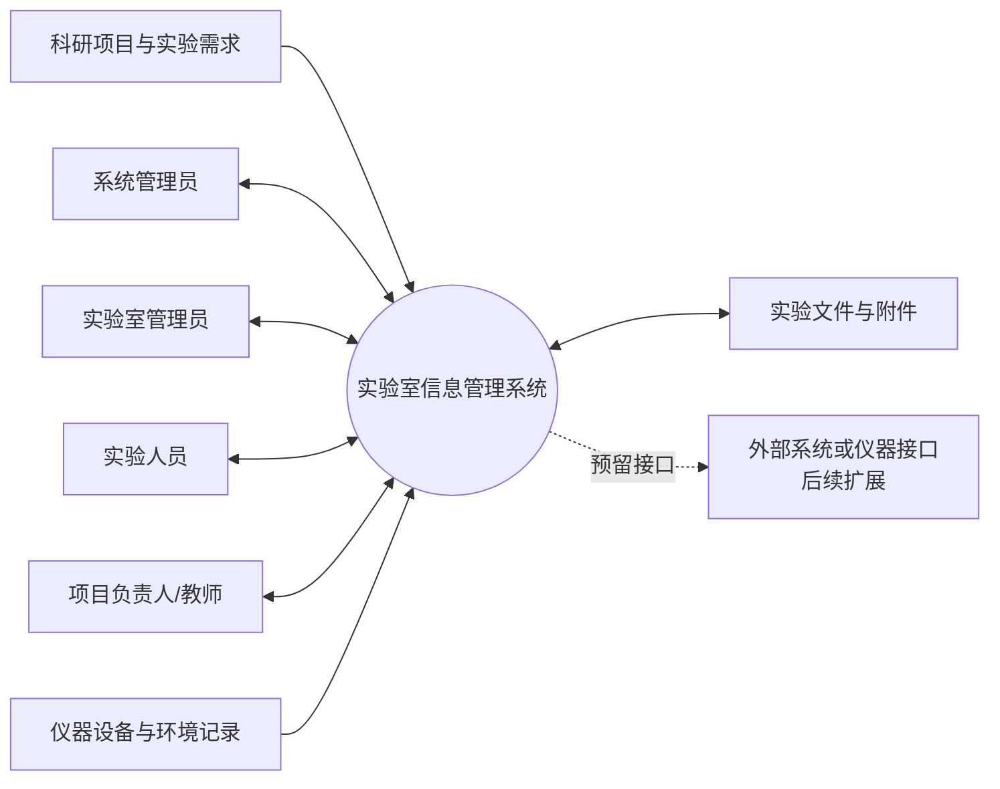
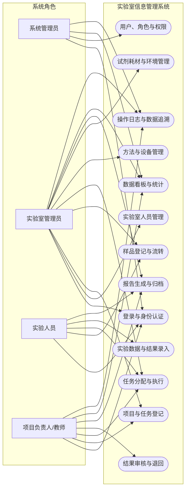
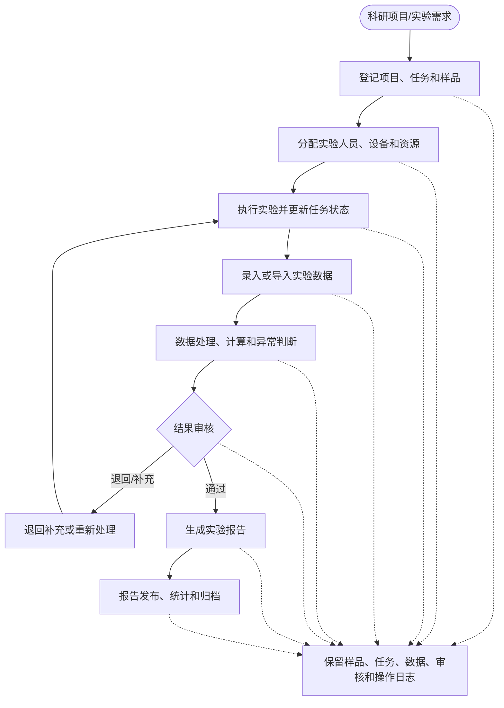
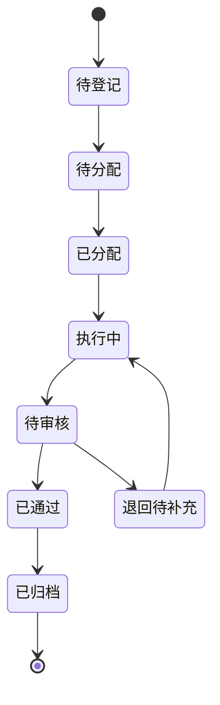
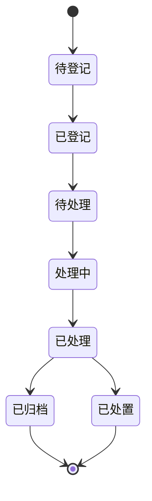
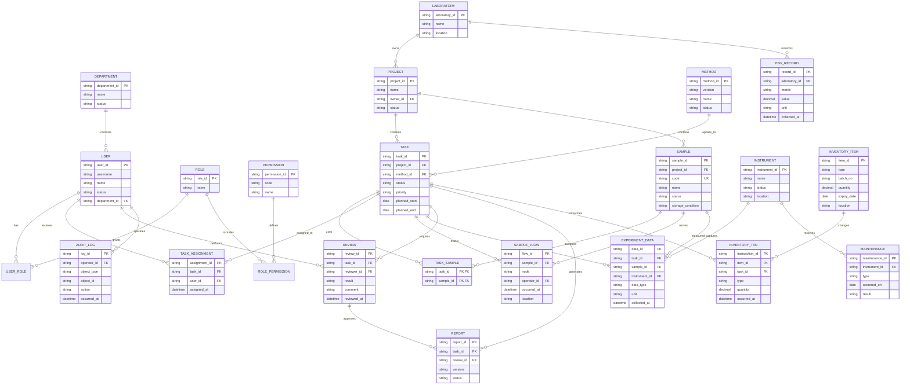

# 核心系统设计模型

| 项目 | 内容 |
| --- | --- |
| 来源 Spec | `specs/001-lims-core/spec.md` |
| 设计状态 | Draft |
| 版本 | v0.1 |
| 更新时间 | 2026-07-11 |

> 本文档记录需求阶段的系统分析模型。它描述系统边界、用户交互、业务流程和核心数据关系，不包含具体编程语言、框架或部署实现。

## 1. 系统上下文图



### 设计说明

- 系统边界内包含用户、任务、样品、数据、资源、审核、报告和日志管理。
- 科研项目或实验需求是业务流程的起点。
- 仪器和环境在第一版中可以使用人工记录或模拟数据。
- 外部系统和真实仪器接口只保留扩展边界，不阻塞基础系统交付。

## 2. 用户用例图



### 用例边界

第一版的每个用例都应至少覆盖：

- 权限检查。
- 业务数据校验。
- 成功结果反馈。
- 异常或失败反馈。
- 关键操作日志。

## 3. 主业务流程图



### 3.1 任务状态模型



### 3.2 样品流转模型



## 4. 核心数据库 ER 图



## 5. 数据设计说明

### 5.1 追溯链

```text
项目
  → 任务
  → 样品
  → 实验数据
  → 审核记录
  → 报告
```

任务还可以关联实验人员、实验方法、仪器设备和试剂耗材。报告不应直接保存无法追溯来源的最终数字；它应能够通过关联查询回到原始数据和审核记录。

### 5.2 设计约束

- `sample.code`、`task.task_id` 和 `report.report_id` 必须唯一。
- 原始数据和处理数据至少需要通过数据类型或独立记录区分。
- 状态变化应使用历史记录或审计日志保留过程。
- 任务、样品和报告的关键记录不建议物理删除，优先采用停用、作废或归档状态。
- 第一版可以使用关系型数据库，文件附件采用独立文件记录与业务实体关联。

## 6. 设计到需求的映射

| 设计产物 | 对应 Spec |
| --- | --- |
| 系统上下文图 | 产品边界、角色、通信扩展 |
| 用户用例图 | `FR-AUTH-*`、`FR-SAMPLE-*`、`FR-TASK-*` 等功能域 |
| 主业务流程 | `BR-001～005`、`FR-TASK-*`、`FR-DATA-*`、`FR-REVIEW-*`、`FR-REPORT-*` |
| 任务状态模型 | 任务状态和审核规则 |
| 样品流转模型 | `FR-SAMPLE-004～006` |
| ER 图 | 数据模型要求、`NFR-DATA-*`、`FR-AUDIT-*` |

## 7. 下一步设计任务

- [x] 根据用例图细化用例说明。
- [x] 根据 ER 图确定字段、索引和约束。
- [x] 根据主流程设计页面导航和页面原型清单。
- [x] 确定 API 边界和接口数据格式。
- [x] 确定前端、后端、数据库和部署技术栈。

详细设计已拆分为：

- [architecture.md](architecture.md)
- [data-model.md](data-model.md)
- [ui.md](ui.md)
- [api-contract.md](api-contract.md)
- [contracts/openapi.yaml](contracts/openapi.yaml)
